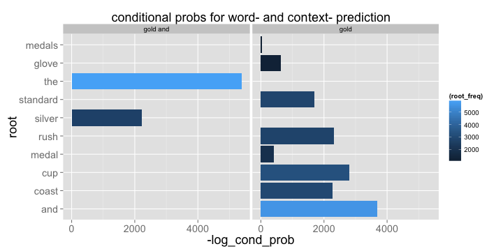

Word RippeR     
========================================================
left: 60%
author: Winston A Saunders
font-family: 'Helvetica'
date: April 19, 2015 
transition: rotate
   
  


***


Word Ripper Use Instructions
========================================================
 
__Toolkit:__      
- Corpus-RippeR:  <small>_creates computable text samples._</small>    
- n-gram-creatoR:  <small>_builds n-gram frequency tables_</small>  
- n-gram-reduceR:   <small>_combines & reduces mulitple n-gram tables._</small>

__Web Interface:__
- Word-RippeR:  <small>[Web based interface](https://ww44ss.shinyapps.io/Coursera_Shiny_Capstone/) _providing_ __context__ _or_ __nearest word__ _based predictions._</small>    
  
<center>__Agile, Flexible, and Compact Natural Language Prediction__</center>
        
Algorithm Description
========================================================

The __Word-Match Algorithm__ as the following steps:  
1. Extract last three words from text string.  
2. Count matches to four-gram "stems".  
3. Repeat for three- and two-grams.  
4. Calculate conditional probabilities and sort results.   
5. Select highest probability/highest order matched n-gram as best match.  

The __Context Match Algorithm__ works similarly, except stop words are removed from text and n-grams processing. 

Markov n-gram look-up tables
========================================================

Basing prediction on n-gram frequencies stored as integers


```r
freq <- as.integer(2000*log10(word_count))
```

give faster look-up based conditional probability


<!-- html table generated in R 3.1.3 by xtable 1.7-4 package -->
<!-- Mon Apr 20 12:15:04 2015 -->
<table border=1>
<tr> <th> n_gram </th> <th> frequency </th> <th> stem </th> <th> root </th> <th> root_freq </th>  </tr>
  <tr> <td> is that the </td> <td align="right"> 2623 </td> <td> is that </td> <td> the </td> <td align="right"> 5855 </td> </tr>
  <tr> <td> would be a </td> <td align="right"> 2860 </td> <td> would be </td> <td> a </td> <td align="right"> 5554 </td> </tr>
  <tr> <td> to be in </td> <td align="right"> 2870 </td> <td> to be </td> <td> in </td> <td align="right"> 5393 </td> </tr>
  <tr> <td> i miss you </td> <td align="right"> 2638 </td> <td> i miss </td> <td> you </td> <td align="right"> 5148 </td> </tr>
   </table>


```r
log_cond_prob <- frequency - root_freq
```

Example Results
=============================================


  
__phrase__: we are in the best   ...   
  ...of  __(word based prediction)__    
  ...supporting  __(context based prediction)__   


 


